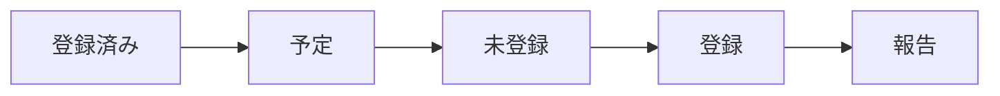

# Meeting Notes Sync

## Overview

終了した会議の Gemini 議事録を資料データベースに取り込む。議事録の正本は Google Doc にあり、データベースが持つのは検索用のコピーである。データベースは `~/batb` にあり、`~/batb/bin/batb` がその操作コマンドである。

処理は登録済みの確認、未登録の抽出、登録、報告の順に進む。



## Scope

対象は、過去 `7` 日に終了した会議のうち、議事録がまだ登録されていないものである。

登録済みの議事録は、保存済み資料の出典から Google Doc の ID を集めて確かめる。

```bash
~/batb/bin/batb query --limit 1000 | grep -o 'document/d/[^/]*' | cut -d/ -f3 | sort -u
```

会議は Google Calendar の `list_events` で取得する。取得の条件を次に示す。

| 項目 | 値 |
| :-- | :-- |
| カレンダー | `y.nakamura@activecore.jp` |
| 開始 | 現在時刻の `7` 日前 |
| 終了 | 現在時刻の `30` 分前 |
| タイムゾーン | `Asia/Tokyo` |
| 件数 | `100` |

予定の添付のうち、名前が `Gemini によるメモ` のものが議事録である。その Google Doc の ID が登録済みの一覧になければ、未登録である。

過去 `7` 日をさかのぼるため、この実行が予定の時刻より遅れていても取りこぼしは起きない。遅れを理由に範囲を広げたり、登録を見送ったりしない。

## Registration

未登録の議事録それぞれについて、本文の取得、会議の用語の確認、登録の順に処理する。

本文は Google Drive の `read_file_content` で取得し、`~/batb/tmp/cogsworth_<doc_id>.txt` に書き出す。

次に、会議そのものを表す用語が登録済みか確かめる。

```bash
~/batb/bin/batb term infer "<予定の名前>"
```

結果に予定の名前と同じ用語がなければ、予定の名前をそのまま登録する。予定の名前はカレンダーに書かれた事実なので、この登録に推測は含まれない。

```bash
~/batb/bin/batb term add --name "<予定の名前>" --category meeting
```

そのうえで議事録を登録する。`--title` に渡した予定の名前から、クライアント名やプロジェクト名などの関係する用語は自動で結び付けられる。

```bash
~/batb/bin/batb save \
  --title "<予定の名前>" \
  --source "https://docs.google.com/document/d/<doc_id>/edit" \
  --content-file ~/batb/tmp/cogsworth_<doc_id>.txt \
  --require-term
```

## Unresolved terms

`--require-term` は、予定の名前からどの用語も結び付けられなかった場合に登録を止める。

この実行に人はいない。止まった議事録について、用語を推測して `--term` で補ってはならない。その議事録は登録せずに飛ばし、予定の名前と Google Doc の ID を報告に残す。判断は後から人が行う。

## Report

新しく登録した件数と、それぞれの予定の名前を挙げる。用語を結び付けられずに飛ばしたものがあれば、予定の名前と Google Doc の ID を併せて挙げる。新規が `1` 件もなければ、その旨を `1` 行で述べる。

議事録の登録以外はしない。リポジトリのファイルの編集やコミットは行わない。
