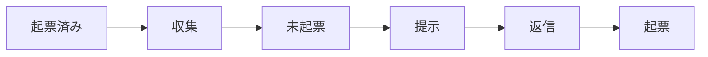

# Todo Issue Sync

## Overview

議事録と Slack に届いた中村勇士宛の依頼を集め、中村に確認したうえで Linear の Issue にする。依頼はそれぞれの場所に残ったままで、ここで作るのは着手の入口となる Issue である。議事録の所在は `~/batb` の資料データベースが持ち、`~/batb/bin/batb` がその操作コマンドである。本文は Google Doc にだけあるので、読むときは Google Drive から取る。

Backlog は対象にしない。依頼は Backlog の課題としてそこに残り、担当も期限もその課題が持つ。Linear に写すと同じ作業が 2 か所に並ぶ。受け皿を持たない議事録と Slack だけが対象である。

処理は起票済みの確認、候補の収集、未起票の抽出、候補の提示、返信を受けての起票の順に進む。



## Registered issues

最初に、起票済みの依頼と、これまでに示した候補を調べる。Linear の `list_issues` を共通の引数で `3` 回呼び、結果を合わせて起票済みの一覧とする。

```yaml
team: marutto-ops
assignee: me
limit: 250
fields: ["title", "description", "url", "statusType"]
```

| argument | 取る Issue |
| :-- | :-- |
| `createdAt: -P14D` | 直近 `14` 日に作られたもの。完了やキャンセルの済んだものも含む |
| `state: started` | 着手中のもの。作成日は問わない |
| `state: unstarted` | 未着手のもの。作成日は問わない |

進行中の作業は `14` 日より前に作られていることもあるので、着手中と未着手は作成日を問わずに取る。`list_issues` の `query` は曖昧検索で、本文に書かれた URL やトークンを拾わないため使わない。

これまでに示した候補は、確認の記録 `~/batb/tmp/plumette-asked.txt` から読む。記録は 1 行に 1 件で、出典の文字列と Issue の title をタブで区切って書いてある。ファイルがなければ、示した候補はまだない。

候補は次の 2 つの照合にかけ、どちらかに当たれば起票しない。表の「未完了」は、`statusType` が `completed` でも `canceled` でもないことを指す。

| check | 照合に使う文字列 | 照合先 |
| :-- | :-- | :-- |
| 出典 | 議事録は Google Doc の ID、Slack は permalink の `p` で始まるタイムスタンプ | 一覧のすべての Issue と確認の記録 |
| ファイル | 依頼の文面が指す Google のスライド・スプレッドシート・ドキュメントの ID | 一覧の未完了の Issue |

出典の照合は、同じ依頼を二度起票せず、二度示さないためにある。ファイルの照合は、進行中の作業に含まれる依頼を別の Issue にしないためにあり、出典のリンクを持たない手作りの Issue もこれで拾える。議事録の Google Doc は出典なので、ファイルの照合には使わない。1 つの会議から別々の宿題が出るためである。

一覧の本文は長いと途中で切れる。出典のリンクは本文の先頭にあるので、出典の照合は一覧の本文で足りる。ファイルの照合にかける候補があるときは、本文が切れた未完了の Issue を先に `get_issue` で全文にする。

文字列が一致しなくても、同じ作業の Issue が既にあるなら起票しない。`PR #N のレビュー依頼` は別の仕組みが作るため、PR のレビューだけを求める依頼がこれにあたる。

## Scope

対象は、2 つの入口それぞれで過去 `2` 日に届いたもののうち、まだ起票されていない依頼である。この実行は毎時走るため、`2` 日あれば数回の失敗を挟んでも取りこぼしは起きない。遅れを理由に範囲を広げたり、起票を見送ったりしない。

議事録は資料データベースから取る。`created` が過去 `2` 日で、出典が Google Doc のものが対象である。

```bash
~/batb/bin/batb query --limit 50
```

出典の Google Doc の ID が起票済みの一覧か確認の記録にある議事録は、本文を読まずに飛ばす。残ったものだけ、出典の URL から Google Drive の `read_file_content` で本文を読む。

Slack は自分宛のメンションを検索する。自分の Slack user id は `slack_search_public_and_private` の説明に書かれた値を使い、他の場所から持ち込まない。`limit` の上限は `20` なので、結果が過去 `2` 日より古くなるまで `cursor` を辿る。

```yaml
keywords: ["<自分の user id のメンション>"]
filters: "after:<2 日前の日付>"
natural_language_query: ""
response_format: detailed
include_context: false
```

## Selection

候補のうち、中村がこれからやることだけを起票する。入口ごとの見分け方を次に示す。

| source | 起票する | 起票しない |
| :-- | :-- | :-- |
| 議事録 | 中村が担当と書かれた宿題・持ち帰り | 担当が書かれていない項目、決定事項の記録 |
| Slack | 中村への依頼・確認・レビュー要請 | cc だけの投稿、お礼や相槌、bot の定型投稿 |

Slack は投稿だけでは依頼かどうか分からないことがある。スレッドの文脈が要るときは `slack_read_thread` で親から読む。

## Proposal

この実行では質問のツールを使えない。候補を Issue の案として番号付きの一覧で示し、実行を終える。中村はこのセッションに返信し、起票する案を番号で選ぶ。

一覧には、案ごとに次の内容を書く。

| item | 書く内容 |
| :-- | :-- |
| 番号 | 返信で案を選ぶための通し番号 |
| title と project | Creation に従って用意したもの。合う project がなければ「なし」 |
| 出典 | 要約と URL。宛先や担当が読み取れない候補は、推測で決めずにその旨を書く |

一覧を示す前に、候補を確認の記録に 1 行ずつ追記する。返信の有無にかかわらず、次の実行が同じ候補を示し直さないためである。

```bash
printf '%s\t%s\n' '<出典の文字列>' '<title>' >> ~/batb/tmp/plumette-asked.txt
```

一覧のあとに、ファイルの照合で飛ばした候補を、出典の URL と同じファイルが書かれた Issue の URL とともに挙げる。候補が `1` 件もなければ、その旨を `1` 行で述べる。

## Creation

返信で番号が挙がった案だけを、Linear の `save_issue` で Issue にする。返信に修正の指示があれば、それに合わせて直してから作る。挙がらなかった案は起票しない。既定値を次に示す。

| field | value |
| :-- | :-- |
| team | `marutto-ops` |
| project | 内容に合う進行中のプロジェクト |
| assignee | `me` |
| state | `Triage` |
| priority | `3` |

project は `list_projects({ team: "marutto-ops", state: "started" })` の一覧と、出典から読み取れるクライアント名やプロジェクト名を突き合わせて選ぶ。迷ったときは `~/batb/bin/batb term infer "<タイトルや文面>"` で用語を確認する。合うものがなければ project を付けない。

title は何をするかを一文で書く。description は出典の引用から始め、リンクを引用の中に埋める。次の実行の重複確認がこの引用を手がかりにするため、リンクは必ず残す。

```markdown
> **戸田弥希** [2026-09-25 09:23](<https://activecorehq.slack.com/archives/C0B7E2BARH7/p1790295838570279>)
>
> 以下2点お願いいたします
> ・来週月曜の内部定例ですがキャンセルでお願いします
```

引用のリンク先は、議事録なら `https://docs.google.com/document/d/<doc_id>/edit`、Slack なら検索結果の permalink とする。引用だけで作業内容が伝わらないときは、引用の下に背景と完了条件を数行で足す。

作った Issue の title と URL を、案ごとに示す。

Issue の作成と確認の記録への追記以外はしない。Slack へ返信せず、Git で管理するファイルの編集やコミットも行わない。
