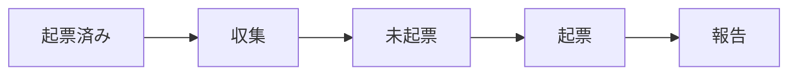

# Todo Issue Sync

## Overview

議事録と Slack に届いた中村勇士宛の依頼を集め、Linear の Issue にする。依頼はそれぞれの場所に残ったままで、ここで作るのは着手の入口となる Issue である。議事録の所在は `~/batb` の資料データベースが持ち、`~/batb/bin/batb` がその操作コマンドである。本文は Google Doc にだけあるので、読むときは Google Drive から取る。

Backlog は対象にしない。依頼は Backlog の課題としてそこに残り、担当も期限もその課題が持つ。Linear に写すと同じ作業が 2 か所に並ぶ。受け皿を持たない議事録と Slack だけが対象である。

処理は起票済みの確認、候補の収集、未起票の抽出、起票、報告の順に進む。



## Registered issues

最初に、起票済みの依頼を調べる。Linear の `list_issues` で、直近 `14` 日に自分へ割り当てられた Issue を本文ごと取る。

```yaml
team: marutto-ops
assignee: me
createdAt: -P14D
limit: 250
fields: ["title", "description", "url", "statusType"]
```

進行中の作業は 14 日より前に作られたこともある。`createdAt` を外し、`state` を `started` と `unstarted` にした 2 回も取って一覧に加える。

`list_issues` の `query` は曖昧検索で、本文に書かれた URL やトークンを拾わない。検索に頼らず、ここで取った一覧と手元で突き合わせる。この実行で起票した Issue も、以降の候補の照合先として一覧に加える。

候補は次の 2 つの照合にかけ、どちらかに当たれば起票しない。

| check | 照合に使う文字列 | 照合先 |
| :-- | :-- | :-- |
| 出典 | 議事録は Google Doc の ID、Slack は permalink の `p` で始まるタイムスタンプ | 一覧のすべての Issue |
| ファイル | 依頼の文面が指す Google のファイル（スライド・スプレッドシート・ドキュメント）の ID | 一覧のうち `statusType` が `completed` でも `canceled` でもない Issue |

出典の照合は、同じ依頼の二度目の起票を防ぐ。ファイルの照合は、進行中の作業に含まれる依頼で Issue を増やさないためのもので、出典のリンクを持たない手作りの Issue もこれで拾える。議事録の Google Doc は出典なのでファイルの照合には使わない。1 つの会議から別々の宿題が出るためである。

一覧の本文は長いと途中で切れる。出典のリンクは本文の先頭にあるので、出典の照合は一覧の本文で足りる。ファイルの照合にかける候補があるときは、本文が切れた照合先を先に `get_issue` で全文にする。

文字列が一致しなくても、同じ作業の Issue が既にあるなら起票しない。`PR #N のレビュー依頼` は別の仕組みが作るため、PR のレビューだけを求める依頼がこれにあたる。

## Scope

対象は、2 つの入口それぞれで過去 `2` 日に届いたもののうち、まだ起票されていない依頼である。この実行は毎時走るため、`2` 日あれば数回の失敗を挟んでも取りこぼしは起きない。遅れを理由に範囲を広げたり、起票を見送ったりしない。

議事録は資料データベースから取る。`created` が過去 `2` 日で、出典が Google Doc のものが対象である。

```bash
~/batb/bin/batb query --limit 50
```

出典の Google Doc の ID が起票済みの一覧にある議事録は、本文を読まずに飛ばす。残ったものだけ、出典の URL から Google Drive の `read_file_content` で本文を読む。

Slack は自分宛のメンションを検索する。自分の Slack user id は `slack_search_public_and_private` の説明に書かれた値を使い、他の場所から持ち込まない。`limit` の上限は `20` なので、結果が過去 `2` 日より古くなるまで `cursor` を辿る。

```yaml
keywords: ["<自分の user id のメンション>"]
filters: "after:<2 日前の日付>"
natural_language_query: ""
response_format: detailed
include_context: false
```

## Selection

候補のうち、中村がこれからやることだけを起票する。入口ごとの見分け方を次に示す。

| source | 起票する | 起票しない |
| :-- | :-- | :-- |
| 議事録 | 中村が担当と書かれた宿題・持ち帰り | 担当が書かれていない項目、決定事項の記録 |
| Slack | 中村への依頼・確認・レビュー要請 | cc だけの投稿、お礼や相槌、bot の定型投稿 |

Slack は投稿だけでは依頼かどうか分からないことがある。スレッドの文脈が要るときは `slack_read_thread` で親から読む。

## Unresolved requests

この実行に人はいない。宛先や担当が読み取れない候補を、推測で Issue にしてはならない。その候補は起票せずに飛ばし、出典の URL と一行の要約を報告に残す。判断は後から人が行う。

## Creation

Issue は Linear の `save_issue` で作る。既定値を次に示す。

| field | value |
| :-- | :-- |
| team | `marutto-ops` |
| project | 内容に合う進行中のプロジェクト |
| assignee | `me` |
| state | `Triage` |
| priority | `3` |

project は `list_projects({ team: "marutto-ops", state: "started" })` の一覧と、出典から読み取れるクライアント名やプロジェクト名を突き合わせて選ぶ。迷ったときは `~/batb/bin/batb term infer "<タイトルや文面>"` で用語を確認する。合うものがなければ project を付けずに作り、報告に名前を挙げる。project の取り違えは後から直せるので、これだけは起票を止める理由にしない。

title は何をするかを一文で書く。description は出典の引用から始め、リンクを引用の中に埋める。次の実行の重複確認がこの引用を手がかりにするため、リンクは必ず残す。

```markdown
> **戸田弥希** [2026-09-25 09:23](<https://activecorehq.slack.com/archives/C0B7E2BARH7/p1790295838570279>)
>
> 以下2点お願いいたします
> ・来週月曜の内部定例ですがキャンセルでお願いします
```

引用のリンク先は、議事録なら `https://docs.google.com/document/d/<doc_id>/edit`、Slack なら検索結果の permalink とする。引用だけで作業内容が伝わらないときは、引用の下に背景と完了条件を数行で足す。

## Report

新しく起票した Issue を、入口ごとに title と URL で挙げる。project を付けられなかった Issue は、後から人が割り当てられるように名前を挙げる。宛先が読み取れずに飛ばした候補は、出典の URL と一行の要約を併せて挙げる。ファイルの照合で飛ばした候補は、出典の URL と、同じファイルが書かれた Issue の URL を併せて挙げる。起票が `1` 件もなければ、その旨を `1` 行で述べる。

Issue の作成以外はしない。Slack へ返信せず、リポジトリのファイルの編集やコミットも行わない。
