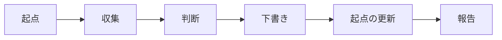

# Mention Reply Drafts

## Overview

Slack・Linear・Backlog で中村勇士に届いたメンションを集め、返信の下書きを作る。下書きは送らずに残し、中村が読んで直してから自分で送る。

下書きの置き場所はサービスごとに違う。Slack には下書きの機能があるので、メンションのスレッドに返信の下書きを作る。Linear と Backlog には下書きの機能がなく、コメントは書いた時点で投稿されるため、下書きの本文はこの実行の報告に書く。

処理は起点の読み込み、メンションの収集、返信の要否の判断、下書き、起点の更新、報告の順に進む。



## Cursor

最初に、前回までに見終えた位置を起点の記録 `~/batb/tmp/potts-cursor.txt` から読む。記録は 1 行に 1 サービスで、サービス名と値をタブで区切って書いてある。

| service | value | example |
| :-- | :-- | :-- |
| `slack` | 見終えた最新の検索結果の `Message_ts` | `1790928655.113639` |
| `linear` | 見終えた最新の通知の `createdAt` | `2026-10-02T06:04:13.714Z` |
| `backlog` | 見終えた最新の通知の `created` | `2026-10-02T06:29:02Z` |

各サービスで、起点より新しいものだけを扱う。時間の幅ではなく起点で区切るので、アプリが閉じていて実行が飛ばされても、その間のメンションは次の実行で拾える。記録がないときや行が欠けているときは、起点を推測で決めずに実行を止め、その旨を報告する。

## Collection

### Slack

自分宛のメンションを検索する。自分の Slack user id は `slack_search_public_and_private` の説明に書かれた値を使い、他の場所から持ち込まない。

```yaml
keywords: ["<自分の user id のメンション>"]
after: "<slack の起点の整数部>"
natural_language_query: ""
sort: timestamp
response_format: detailed
include_context: false
```

`limit` の上限は `20` なので、`cursor` を辿って起点より新しい結果をすべて取る。`after` は起点と同じ秒を含むため、`Message_ts` が起点以下の結果は除く。bot の投稿と自分の投稿も除く。

### Linear

`get_notifications` で受信箱を新しい順に取り、`createdAt` が起点以前の通知が出るまで `cursor` を辿る。対象は `category` が `mentions` の通知である。

通知の本文は途中で切れている。通知の `url` から Issue の ID を取り、`list_comments` で該当のコメントと前後のやり取りを全文で読む。`url` の末尾の `#comment-<id>` が、メンションのコメントを指す。

### Backlog

`get_notifications` を `order: desc`、`count: 4` で呼び、`created` が起点以前の通知が出るまで、取れた中で最も小さい `id` から `1` を引いた値を `maxId` に渡して遡る。通知は 1 件が大きく、`count` を増やすと結果が出力の上限を超えるため、`4` より大きくしない。

Backlog の通知は、ウォッチ中の課題の更新やお知らせの宛先に入っただけでも届く。対象は、コメントの本文が中村に宛てたものに限る。宛先は本文の先頭の `@` に続く名前で示されるので、その名前が自分（`get_myself` の `name`）であるか、本文が中村に呼びかけているものを対象とする。本文が別の人に宛てたものは、お知らせの宛先に中村が入っていても対象にしない。

前後のやり取りは、課題なら `get_issue_comments`、プルリクエストなら `get_pull_request_comments` で読む。

## Selection

返信が要るメンションにだけ下書きを作る。

| 下書きを作る | 下書きを作らない |
| :-- | :-- |
| 質問、依頼、確認、レビューの要請、日程の相談 | お礼や相槌、完了の報告、cc だけの投稿、bot の定型投稿 |

メンションより後に中村の投稿があれば返信済みとみなし、下書きを作らない。サービスごとの確かめ方を次に示す。

| service | check |
| :-- | :-- |
| Slack | permalink の `thread_ts` をスレッドの親として `slack_read_thread` で読み、メンションより後に自分の投稿があるか |
| Linear | `list_comments` の結果で、メンションのコメントより後に自分のコメントがあるか。自分は `get_user({ query: "me" })` で確かめる |
| Backlog | メンションのコメント ID を `minId` に渡して前後のやり取りを読み、自分（`get_myself` の `id`）のコメントがあるか |

## Drafting

下書きは中村の立場で、メンションへの返答として書く。書く前に前提を集める。

- スレッドや Issue のやり取りを親から読み、何を求められているかをつかむ
- クライアント名・案件名・会議名が出てきたら、`~/batb/bin/batb term infer "<文面>"` で用語を確かめ、`~/batb/bin/batb query --term <用語>` で関係する資料を探して読む
- 資料ややり取りで確かめられない事実は書かない。決められないことや中村にしか分からないことは、`〔要確認：…〕` と書いて残す

文体は相手とサービスに合わせる。

| service | style |
| :-- | :-- |
| Slack | 先頭の行で相手をメンションする（ `<@U...>` ）。社内向けは丁寧で軽めに書く（例：「承知です！」「確認させてください:pray:」） |
| Linear | 先頭で相手を `@` で呼び、Markdown で書く |
| Backlog | 先頭の行に `@<相手の名前>` を書き、空行を挟んで本文を書く。クライアントも読むため敬語で書く |

Slack は `slack_send_message_draft` で、メンションのチャンネルに下書きを作る。`thread_ts` にスレッドの親を渡し、スレッドへの返信にする。Slack はチャンネルごとに下書きを `1` つしか持てないため、`draft_already_exists` などで作れなかったときは、エラーと本文を報告に書く。

Linear と Backlog は、下書きの本文を報告に書く。

## Cursor update

各サービスで見終えた最新の値で、起点の記録を書き換える。下書きを作らなかったメンションや対象外の通知も、見終えたものに含める。取得に失敗したサービスは起点を書き換えず、次の実行で同じ範囲を見直す。

```bash
printf 'slack\t%s\nlinear\t%s\nbacklog\t%s\n' '<slack>' '<linear>' '<backlog>' > ~/batb/tmp/potts-cursor.txt
```

## Report

下書きを作ったメンションを表にまとめる。要旨には、メンションへのリンクを付ける。

```markdown
| # | service | 相手 | 要旨 | 下書き |
| --: | :-- | :-- | :-- | :-- |
| 1 | Slack | 松本直 | [同期で状況を共有したい](<permalink>) | Slack に作成 |
| 2 | Linear | 松本直 | [PR #229 で解消済みかの確認](<url>) | 下記 |
```

表のあとに、報告に本文を書く下書きを、番号・サービス・リンクの見出しと、そのまま貼れるコードブロックで挙げる。下書きを作らなかったメンションは、件数と理由（返信済み・返信不要）を `1` 行で添える。新しいメンションが `1` 件もなければ、その旨を `1` 行で述べる。

下書きの作成と起点の記録の書き換え以外はしない。メッセージやコメントを投稿せず（ `slack_send_message`、`slack_schedule_message`、Linear の `save_comment`、Backlog の `add_issue_comment` と `add_pull_request_comment` を使わない）、通知を既読にしない。資料データベースは検索にだけ使い、保存しない。Git で管理するファイルの編集やコミットも行わない。
