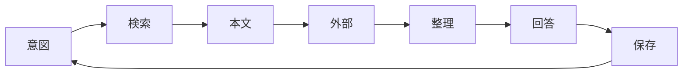

# BatB

## Overview

BatB は会議・チャット・ドキュメントの文脈を Agent に渡すためのワークスペースである。SQLite の Lumiere（ `db/lumiere.sqlite` ）に資料をキャッシュし、共通語彙で検索と分類をそろえる。資料の正本は外部サービス側（Backlog URL、Google Doc URL など）にあり、Lumiere は索引とローカルコピーを保持する。外部に正本を持たないローカルファイルは `files/` に取り込み、そこを正本とする。

Lumiere のスキーマと CLI の詳細は [docs/lumiere.md](./docs/lumiere.md)、議事録の自動取り込みは [docs/cogsworth.md](./docs/cogsworth.md) にまとめている。

`reference` テーブルが資料の索引兼キャッシュである。`query` で絞り込み、`get` で本文まで取る。`content` が空のときは `source` から取り直して `save` する。用語の正本は `terms` テーブル群（共通語彙）で、save 時に title から自動推定する。同一 `source` への再 `save` は upsert される。

| table | role |
| :-- | :-- |
| `reference` | 資料の索引・本文キャッシュ |
| `terms` | 共通語彙（client / meeting / person / project / process / team / system） |
| `term_aliases` | 別名・タイトルマッチ用パターン |
| `reference_terms` | 資料と用語の紐付け |
| `term_relations` | 用語間の関係（works_for, part_of, uses など） |

`save` の直後、バックグラウンドで語彙ジョブ（ `term learn` ）が走り、本文から用語・別名・用語間の関係を登録する。既存の用語は名前と別名で引き当てるため、`阪急` のような別名が新しい用語として増えることはない。会議だけは例外で、語彙ジョブは新しく作らない。会議は Google Calendar の予定名で `term add --category meeting` する。同じ処理は `term learn ID` で手動でも実行できる。

```
batb/
  CLAUDE.md
  docs/lumiere.md
  docs/cogsworth.md
  schema.sql
  graph.html
  bin/batb
  .claude/commands/cogsworth.md
  .claude/commands/script/
  .claude/scheduled-tasks/
  db/lumiere.sqlite
  files/
  tmp/
```

## CLI reference

よく使う操作を次に示す。`list` は `query` の alias である。

| operation | command |
| :-- | :-- |
| 保存 | `batb save --title T --source URL --content-file PATH [--term NAME ...] [--require-term]` |
| 保存（ローカル） | `batb save --title T --source PATH [--term NAME ...] [--require-term]` |
| 本文 | `batb get ID` |
| 検索 | `batb query [KEYWORD ...]` / `query --term NAME ...` |
| 用語推定 | `batb term infer "タイトルや文面"` |
| 用語一覧 | `batb term list [--category CAT]` |
| 用語詳細 | `batb term query NAME`（完全一致で詳細表示） |
| 用語追加 | `batb term add --name N --category CAT [--alias A ...]` |
| 用語統合 | `batb term merge SRC --into DST`（別名・紐付け・関係を移す） |
| 用語削除 | `batb term remove NAME`（資料が紐付いていれば拒否する） |
| 語彙学習 | `batb term learn ID`（手動・バッチ用） |
| 資料の用語 | `batb reference link list|add|remove|set ID --term NAME ...` |
| 関係グラフ | `batb graph [--out PATH]` |

## Agent workflow

各ターンは意図、検索、本文、外部補完、整理、回答、保存の 7 段階を回す。同一会話内で既に `get` した本文は使い回し、不要な再 fetch を避ける。



Agent はメタデータ登録・本文キャッシュ・用語付与・語彙ジョブの起動まで行う。本文からの用語と関係の抽出はバックグラウンドジョブが担う。

| principle | detail |
| :-- | :-- |
| 先に検索 | 回答・判断・実装の前に reference を検索する |
| 自動保存 | 参照しうる資料と会話で得た新情報は、頼まれなくても `save` する |
| 文脈の再利用 | 同一会話内の取得済み本文を使い回す |
| 不確実性の分離 | 合意・進行中・未確認を混同しない |
| 根拠の明示 | 議事録・課題・予定など、出典を示す |
| 推測の禁止 | reference・Calendar・Backlog を見ずに断定しない |

検索では、クライアント名・会議名・プロジェクト名・課題キー・人名など、文脈から複数パターンを試す。`term infer` で拾える用語を確認してから `query --term` する。論点や決定事項を突き合わせるには `get <id>` で本文まで取る。

```bash
~/batb/bin/batb term infer "確定：トリプルエスさま定例"
~/batb/bin/batb term query トリプルエス
~/batb/bin/batb query --term トリプルエス
~/batb/bin/batb query 要件 HTML
~/batb/bin/batb query --limit 10
```

## Source formats

`save` するときの `--source` は種別ごとに次の形式で書く。形式をそろえると同一資料の重複登録を防げる。初回 save か更新時だけ外部から fetch し、以降は `get` を使う。本文は一時ファイルに書いてから `save` する。

ローカルファイルを `--source` に渡すと、`files/` へコピーしたうえで、そのコピーの絶対パスを `source` に記録する。元のファイルが消えても資料は残る。このとき本文はコピーしたファイルから読むため、`--content-file` は省略する。ファイル名が同じ資料は同じ 1 件として扱われるため、日付や版を含む名前を付ける。

`--require-term` を付けると、title からの用語推定に失敗した場合に save を止める。推定できないときは `term infer` の結果をユーザーに確認し、`--term` で明示してから save する。

| type | source format | fetch |
| :-- | :-- | :-- |
| Backlog | `https://{space}.backlog.com/view/{ISSUE_KEY}` | `get_issue` / `get_issue_comments` |
| Slack | permalink URL | `slack_read_thread` / `slack_read_channel` |
| Google Doc | `https://docs.google.com/.../d/{id}/edit` | `read_file_content` |
| Notion | `https://www.notion.so/{pageId}` | Notion MCP |
| local | `files/{ファイル名}` の絶対パス | ファイル read |

## Cogsworth

Cogsworth は、終了したカレンダー予定に添付された Gemini 議事録を `reference` に登録する仕組みである。仕組みと運用は [docs/cogsworth.md](./docs/cogsworth.md)、Agent が実行する手順は `.claude/commands/cogsworth.md` にまとめている。

`/cogsworth` でバックグランドループを起動し、`/cogsworth off` で停止する。合図（ `AGENT_LOOP_TICK_COGSWORTH` ）を受け取ったら、未登録の議事録だけを `save --require-term` で登録し、新規件数を短く報告する。用語を推定できない場合は推測せず、`term infer` の結果をユーザーに確認する。
