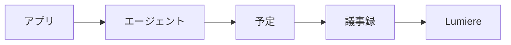

# Cogsworth

## Overview

Cogsworth は、終了したカレンダー予定に添付された Gemini 議事録を Lumiere の `reference` に取り込む仕組みである。会議のたびに手で保存しなくても、平日の日中に一定の間隔で取り込みが走る。議事録の本文は Google Doc 側にだけあり、Lumiere が持つのは議事録の所在と用語である。登録した議事録からは、本文を読んで共通語彙も学習する。

このドキュメントは仕組みと運用を説明する。Agent が実行する手順と実行タイミングは `.claude/scheduled-tasks/cogsworth/SKILL.md` にある。

## Mechanism

Cogsworth は Claude デスクトップアプリの定期タスクとして動く。アプリは設定された時刻にセッションを起動し、Agent がプロンプトに従って未登録の議事録を登録する。人が立ち会わない実行なので、用語を結び付けられない議事録は登録せずに報告へ残す。

アプリが読み込むのは `~/.claude/scheduled-tasks/cogsworth/SKILL.md` で、このリポジトリの `SKILL.md` はその正本である。変更をアプリへ反映する手順は `.claude/scheduled-tasks/README.md` にある。

## Operations

有効と無効の切り替え、実行タイミングの変更、今すぐの実行は、アプリの定期タスクの画面で行う。実行タイミングを変えたら、 `SKILL.md` の `schedule` も同じ値に揃える。

報告に残った議事録は、予定の名前に対応する用語か別名を登録すれば取り込める。対象は過去 `7` 日の予定なので、その範囲にある限り次の実行で登録される。

## Troubleshooting

よくある症状と対処を示す。

| symptom | action |
| :-- | :-- |
| 予定の時刻になっても取り込まれない | 定期タスクはアプリが開いていて Mac が起きているときだけ動く。見逃した実行は、復帰後に直近の 1 回分だけ実行される |
| 議事録が登録されずに報告だけ残る | 予定の名前から用語を結び付けられていない。用語か別名を登録して次の実行を待つ |
| 語彙の学習の失敗が報告に残る | 議事録の登録は済んでいる。報告のエラーから原因を直し、本文を取り直して `term learn <id> <本文のファイル>` を実行する |
