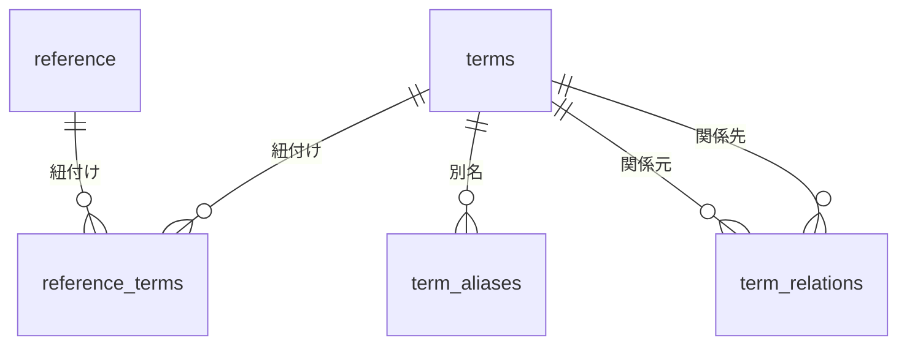

# Lumiere

## Overview

Lumiere は BatB のローカル DB で、ファイルは `db/lumiere.sqlite` に置く。Lumiere は資料の本文を持たず、タイトルと所在だけを記録する。Backlog の課題や Google Doc など外部サービスにある資料は URL を所在とし、本文はそのサービスから取得する。ローカルファイルは `files/` に取り込み、そこを正本とする。資料の索引は `reference` テーブル、クライアント名・会議名・人名などの共通語彙は `terms` ほかのテーブルで管理する。詳細な手順は [CLAUDE.md](../CLAUDE.md) を参照する。

## Schema

Lumiere は資料レイヤと共通語彙レイヤの 2 層で構成する。資料は `reference` に集約し、用語は `terms` 系テーブルに集約する。資料と用語の対応は `reference_terms` が結ぶ。



### Reference layer

`reference` は会議議事録・課題・ドキュメントの所在を 1 行で表す。`source` は重複登録を防ぐ一意キーである。

| column | description |
| :-- | :-- |
| `id` | UUID |
| `title` | 会議名・課題名など |
| `source` | 正本の URL、または `files/` 内のファイルの絶対パス |
| `created_at` / `updated_at` | 登録・更新日時 |

### File storage

外部サービスに正本を持たない資料は、リポジトリ内の `files/` に置く。`save --source` にローカルファイルのパスを渡すと、`files/<ファイル名>` へコピーし、そのコピーの絶対パスを `source` に記録する。元のファイルが一時ディレクトリや別のワークツリーにあっても、資料は消えない。外部サービスの URL はコピーせず、そのまま記録する。

| 入力 | 記録される `source` |
| :-- | :-- |
| `/tmp/report.md` | `<repo>/files/report.md`（コピーを作る） |
| `file:///tmp/report.md` | `<repo>/files/report.md`（同上） |
| `<repo>/files/report.md` | そのまま（コピーしない） |
| URL | そのまま |

同一性はファイル名で決まる。同じファイル名で `save` すると同じ 1 件を更新するため、日付や版を名前に含めて区別する。`files/` のファイル自体を置き換えるときは、そのファイルを上書きしてから `save` する。

`files/` は `db/` と同じくローカル資産であり、git の追跡対象にしない。

### Vocabulary layer

共通語彙の正本は `terms` である。マスタデータは `schema.sql` が担う。category は次の 8 種類に限定する。

| category | examples |
| :-- | :-- |
| `client` | トリプルエス、SABON |
| `meeting` | 確定：トリプルエスさま定例、FDEデイリー |
| `person` | 永田、小松 |
| `project` | marutto、PoC型化 |
| `process` | HTML制作、修正対応 |
| `team` | マーケOps、FDE |
| `system` | build-html-tool、Backlog、KARTE |
| `meta` | マネジメント、キャリア |

`term_aliases` は別名とタイトルマッチ用パターンをまとめたテーブルである。`save` 時の自動推定と `term infer` は、タイトルや本文に `name` または `alias` が含まれるかを大文字小文字の別なく調べて用語を拾う。

`name` を含む別名は登録しない。`name` が一致する場所では別名も必ず一致するため、区別に寄与しない。`阪急交通社` に対する `阪急` のように、`name` より短い表記だけを別名にする。

会議は Google Calendar の予定名だけを `name` に採用する。予定名でない呼び方は別名にする。語彙の学習（`term learn`）は会議を新しく作らず、既存の会議に引き当てられなければ読み飛ばす。新しい会議は予定名で `term add --category meeting` する。

`reference_terms` は資料と用語の多対多リンクである。

`term_relations` は用語間の関係を表す。

| relation | meaning |
| :-- | :-- |
| `works_for` | 人物がプロジェクトやチームに所属 |
| `part_of` | 会議がクライアントに紐づく、人物が工程を担当する、など |
| `uses` | 工程がシステムを利用 |
| `member_of` | メンバー関係（将来用） |
| `alias_of` | 別名関係（将来用） |

## CLI

CLI のサブコマンド名は英語のままだが、ドキュメント上は「共通語彙」と呼ぶ。`term` は共通語彙を操作するサブコマンド群である。

### Reference commands

資料の保存と検索に使う。

| command | role |
| :-- | :-- |
| `save --title ... --source ...` | 保存（同一 `source` は upsert） |
| `save ... [--term NAME ...] [--require-term]` | 用語を手動指定、または title から自動推定 |
| `query [KEYWORD ...]` | タイトルと `source` の検索 |
| `query --term NAME ...` | 用語で絞り込み |
| `list` | `query` の alias |

### Reference-link commands

資料に付いた用語を手で直すときに使う。

| command | role |
| :-- | :-- |
| `reference link list ID` | 紐付き用語の一覧 |
| `reference link add ID --term NAME ...` | 用語を追加 |
| `reference link remove ID --term NAME ...` | 用語を削除 |
| `reference link set ID --term NAME ...` | 用語を置換 |

### Vocabulary commands

共通語彙の参照・追加・学習に使う。いずれも `batb term` で始まる。

| command | role |
| :-- | :-- |
| `term list [--category CAT]` | 用語一覧 |
| `term query KEYWORD ...` | 用語検索（1 語の完全一致なら詳細表示） |
| `term infer TEXT ...` | テキストから用語を推定 |
| `term add --name ... --category ...` | 用語を手動追加 |
| `term merge SRC --into DST` | 用語を統合 |
| `term remove NAME` | 用語を削除 |
| `term learn ID < JSON` | 資料の本文から抽出した用語と関係を登録し、資料に紐付ける |

### Graph command

共通語彙の関係を 1 枚のページに書き出す。リポジトリ直下の `graph.html` をテンプレートとし、`terms`・`term_aliases`・`term_relations`・`reference_terms` の現在の中身を埋め込む。

| command | role |
| :-- | :-- |
| `graph [--out PATH]` | 関係グラフの HTML を書き出す（既定の出力先は `tmp/lumiere-graph.html`） |

ページでは円が用語、色が category、大きさが紐付いた資料の数、線が `term_relations` を表す。分類と関係で絞り込め、用語を選ぶと別名と前後の関係が読める。データは書き出した時点の写しなので、語彙が変わったら作り直す。

## Workflows

検索では、まずタイトルや文面から拾える用語を確認し、その用語で資料を絞り込む。本文は、見つかった資料の `source` から取得する。

```bash
batb term infer "確定：トリプルエスさま定例"
batb term query トリプルエス
batb query --term トリプルエス
```

保存では、title から用語を自動推定できる場合は `--term` を省略できる。推定できない場合は `--require-term` 付きで save を止め、用語を確認してから `--term` を付ける。

```bash
batb save --title "..." --source "..." --require-term
batb save ... --term トリプルエス --term FDE
```

本文を読んだ資料は、本文から用語と関係を抽出して JSON にまとめ、`save` が返した ID とともに `term learn` の標準入力へ渡す。JSON の形と抽出の規則は [Learning](#learning) に示す。

```bash
batb term learn <id> <<'EOF'
{"terms": [{"name": "トリプルエス", "category": "client"}], "relations": []}
EOF
```

## Growth

共通語彙は保存のたびに育つ。`schema.sql` は初期構築の種であり、DB ができたあとの正本は `terms` 系テーブルである。既存 DB に対して `schema.sql` を編集しても反映されない。

育て方は学習と手入れの 2 つがある。学習は、資料を読んだ Agent が本文から用語・別名・関係を抽出し、`term learn` で登録する。手入れは `term add` `term merge` `term remove` で、語彙の重複や粒度を人が整える。

### Learning

`term learn` に渡す JSON は次の形をとる。`terms` は空にできない。

```json
{
  "terms": [
    {"name": "トリプルエス", "category": "client", "aliases": ["トリプルS"], "description": "クライアント"},
    {"name": "永田", "category": "person"}
  ],
  "relations": [
    {"from": "永田", "to": "プランニング", "relation": "part_of"}
  ]
}
```

抽出では次の規則に従う。

| 項目 | 規則 |
| :-- | :-- |
| 対象 | 本文に現れるクライアント・人物・プロジェクト・業務工程・チーム・システム・会議 |
| `name` | 既存の用語は `term list` の表記を 1 文字も変えずに書く。本文の表記が違うときは、その表記を `aliases` に入れる |
| `category` | `client` `person` `project` `process` `team` `system` `meeting` のいずれか |
| 会議 | `term list` にある会議だけを挙げる。会議は Google Calendar の予定名だけを採用するため、一覧に無い会議は挙げない |
| `relations` | `works_for`（人物→プロジェクト・チーム）、`part_of`（会議→クライアント、人物→業務工程）、`uses`（業務工程→システム）の 3 種類。`from` と `to` には用語の名前を書く |

`term learn` は次の規則で語彙を壊さないようにしている。規則に合わずに読み飛ばしたものは警告に出し、最後に資料に紐付いた用語を表示する。

| 規則 | 内容 |
| :-- | :-- |
| 引き当て | まず名前と別名の完全一致、次に同じ分類の用語名への包含（ちょうど 1 件のときだけ） |
| 登録の失敗 | 許可外の category などで登録できなかった用語は、資料に紐付けずに警告を出す |
| 別名 | 用語名や既存の別名を含む別名は登録しない |
| 関係 | `works_for` `part_of` `uses` の 3 種類だけを受け付け、両端が既存の用語に引き当たるものだけ登録する |

関係の端点から用語を新しく作ることはない。同じ JSON に含まれる用語は先に登録するため、その回に現れた用語も端点にできる。

一覧に無い表記が渡されたときは、同じ分類の用語名にちょうど 1 件含まれる場合だけ、その用語に引き当てて表記を別名に加える。`トリプルエスさま定例` は `確定：トリプルエスさま定例` に吸収される。複数に含まれる `定例` のような語は新しい用語になるので、`term merge` で人が統合する。

この引き当ては `term add` も通る。`term add --name トリプルエスさま定例 --category meeting` は新しい会議を作らず、既存の用語にその表記を別名として加える。名前か別名が一致した場合は分類より名前を優先するため、既存と同じ名前を別の分類で追加することはできない。

## Migration

既存 DB は初回起動時に次の変換を自動で行う。

| before | after |
| :-- | :-- |
| `db/refs.sqlite` | `db/lumiere.sqlite`（ファイル名の rename） |
| テーブル `refs` | `reference` |
| 列 `summary` / `content` | 削除 |
| `tags` / `ref_tags` / `tag_rules` | `terms` / `reference_terms` / `term_aliases` |
| category `tool` | `system` |

変換は 1 回の実行で完結し、旧テーブルは変換後に削除する。変換中にエラーが起きた場合は 1 件も書き換えずに中断する。
