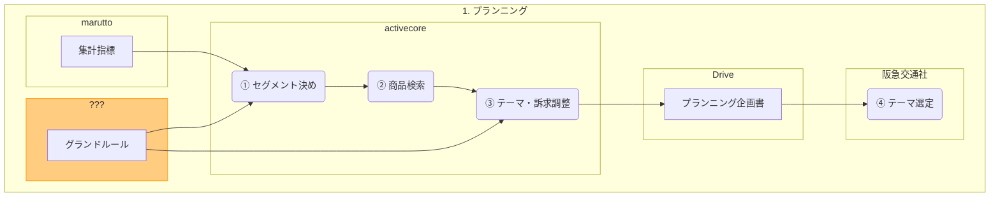
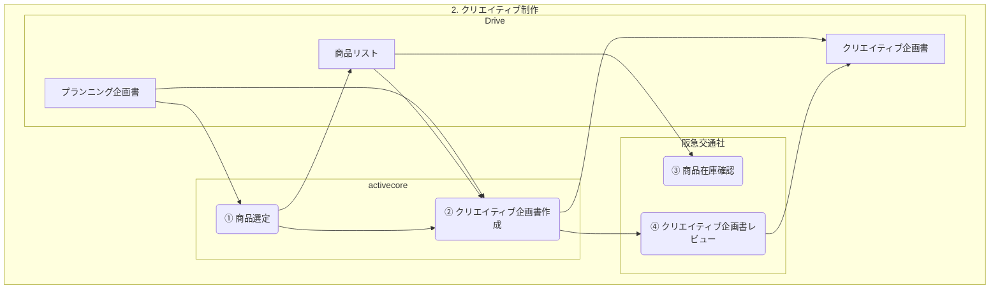
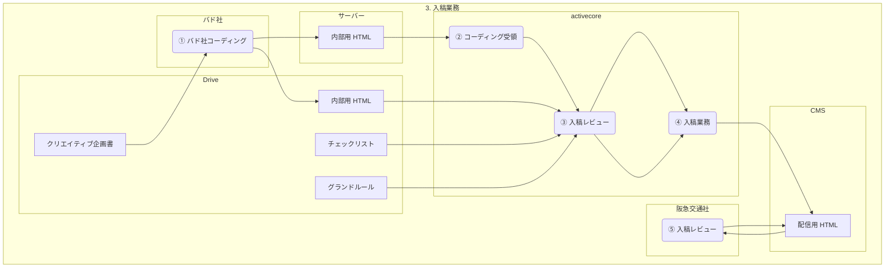
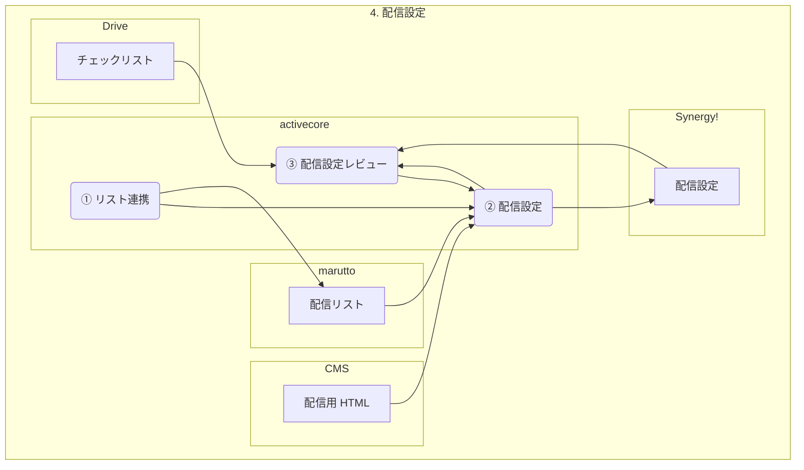
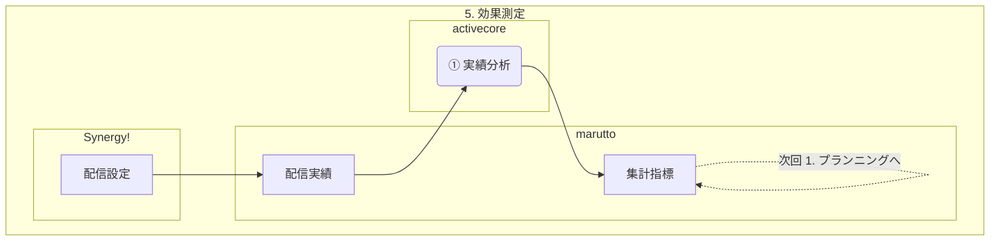

# 阪急 AS-IS フロー

出典: [NB クライアント×工程 マトリクス](https://activecorehq.slack.com/files/U0438RB4V8T/F0BP74WBZKJ/nb_clientprocessmatrix.html)

**規模:** 70本/月　**時点:** 2026年8月（7月実績ベース）

---

## 記法

| 要素 | Mermaid | 意味 |
| :-- | :-- | :-- |
| **角丸** | `(① 処理)` | 作業・プロセス（①〜の連番） |
| **四角** | `[成果物]` | データ・成果物 |
| **工程の枠** | `subgraph` | 1〜5 の各工程 |
| **担当の枠** | `subgraph` | activecore / 阪急交通社 / バド社 |
| **システムの枠** | `subgraph` | 成果物の格納先 |

- 角丸（処理）は **activecore**・**阪急交通社**・**バド社** のいずれかの枠に入れる
- 四角（成果物）は **格納システム** の枠に入れる
- 図の向きはすべて **LR**（左→右）
- ノードラベルは `1.` ではなく **①** 形式（Mermaid の unsupported markdown list 回避）

---

## Lv 定義

| Lv | 定義 | 人が残す作業 |
| :-- | :-- | :-- |
| **L0** | 完全人手 | 全作業 |
| **L1** | 支援ツールあり | 起動・確認・格納・連絡・採点 |
| **L2** | ジョブ化 | 成果物チェックのみ |
| **L3** | チェーン化 | 例外対応のみ |
| **L4** | 完全自動 | 例外のみ |

---

## 全体像

```mermaid
flowchart LR
  subgraph PH1["1. プランニング"]
    direction LR
    subgraph M1["marutto"]
      d14[集計指標]
    end
    subgraph UNK1["???"]
      d12[グランドルール]
    end
    subgraph DR1["Drive"]
      d13[プランニング企画書]
    end
    subgraph AC1["activecore"]
      direction LR
      p11(① セグメント決め)
      p12(② 商品検索)
      p13(③ テーマ・訴求調整)
      p11 --> p12 --> p13
    end
    subgraph HK1["阪急交通社"]
      p14(④ テーマ選定)
    end
    d14 --> p11
    d12 --> p11 & p13
    p13 --> d13 --> p14
  end
  style UNK1 fill:#ffcc80,stroke:#ff9800,color:#333

  subgraph PH2["2. クリエイティブ制作"]
    direction LR
    subgraph DR2["Drive"]
      d21[プランニング企画書]
      d22[商品リスト]
      d23[クリエイティブ企画書]
    end
    subgraph AC2["activecore"]
      direction LR
      p21(① 商品選定)
      p22(② クリエイティブ企画書作成)
      p21 --> p22
    end
    subgraph HK2["阪急交通社"]
      p23(③ 商品在庫確認)
      p24(④ クリエイティブ企画書レビュー)
    end
    d21 --> p21 --> d22
    d21 & d22 --> p22 --> d23
    d22 --> p23
    p22 --> p24 --> d23
  end

  subgraph PH3["3. 入稿業務"]
    direction LR
    subgraph BADO3["バド社"]
      p31(① バド社コーディング)
    end
    subgraph AC3["activecore"]
      direction LR
      p32(② コーディング受領)
      p33(③ 入稿レビュー)
      p34(④ 入稿業務)
      p32 --> p33 --> p34
    end
    subgraph HK3["阪急交通社"]
      p35(⑤ 入稿レビュー)
    end
    subgraph DR3["Drive"]
      d31[クリエイティブ企画書]
      d32[内部用 HTML]
      d33[チェックリスト]
    end
    subgraph SV3["サーバー"]
      d34[内部用 HTML]
    end
    subgraph CMS3["CMS"]
      d35[配信用 HTML]
    end
    d31 --> p31 --> d32 & d34
    d34 --> p32
    d32 & d33 --> p33 --> p34 --> d35 --> p35 --> d35
  end

  subgraph PH4["4. 配信設定"]
    direction LR
    subgraph AC4["activecore"]
      direction LR
      p41(① リスト連携)
      p42(② 配信設定)
      p43(③ 配信設定レビュー)
      p41 --> p42 --> p43 --> p42
    end
    subgraph M4["marutto"]
      d41[配信リスト]
    end
    subgraph CMS4["CMS"]
      d42[配信用 HTML]
    end
    subgraph SYN4["Synergy!"]
      d43[配信設定]
    end
    subgraph DR4["Drive"]
      d44[チェックリスト]
    end
    p41 --> d41
    d42 & d41 --> p42 --> d43 --> p43
    d44 --> p43
  end

  subgraph PH5["5. 効果測定"]
    direction LR
    subgraph M5["marutto"]
      d51[配信実績]
      d52[集計指標]
    end
    subgraph AC5["activecore"]
      p51(① 実績分析)
    end
    d51 --> p51 --> d52
  end

  PH1 --> PH2 --> PH3 --> PH4 --> PH5
  PH5 -.->|集計指標| PH1
```

| # | 工程 | input | output | 主担当 |
| :-- | :-- | :-- | :-- | :-- |
| 1 | プランニング | 集計指標 | プランニング企画書 | activecore / 阪急 |
| 2 | クリエイティブ制作 | プランニング企画書 | 商品リスト, クリエイティブ企画書 | activecore / 阪急 |
| 3 | 入稿業務 | クリエイティブ企画書 | 内部用 HTML, 配信用 HTML | バド社 / activecore / 阪急 |
| 4 | 配信設定 | 配信用 HTML | 配信リスト, 配信設定 | activecore |
| 5 | 効果測定 | 配信実績 | 集計指標 | activecore |

---

## 工程別詳細

### 1. プランニング

**input:** 集計指標（5. 効果測定の output）  
**output:** プランニング企画書

| 処理 | 担当 | 入力 | 出力 | Lv |
| :-- | :-- | :-- | :-- | :-- |
| ① セグメント決め | activecore | 集計指標, グランドルール | セグメント | L1 |
| ② 商品検索 | activecore | セグメント | 商品候補 | L1 |
| ③ テーマ・訴求調整 | activecore | 商品候補, グランドルール | プランニング企画書（案） | L1 |
| ④ テーマ選定 | 阪急交通社 | プランニング企画書（案） | プランニング企画書 | — |

---

### 2. クリエイティブ制作

**input:** プランニング企画書  
**output:** 商品リスト, クリエイティブ企画書

| 処理 | 担当 | 入力 | 出力 | Lv |
| :-- | :-- | :-- | :-- | :-- |
| ① 商品選定 | activecore | プランニング企画書 | 商品リスト | L1 |
| ② クリエイティブ企画書作成 | activecore | プランニング企画書, 商品リスト | クリエイティブ企画書 | L1 |
| ③ 商品在庫確認 | 阪急交通社 | 商品リスト | 在庫確認結果 | — |
| ④ クリエイティブ企画書レビュー | 阪急交通社 | クリエイティブ企画書 | 承認／修正指示 | — |

---

### 3. 入稿業務

**input:** クリエイティブ企画書  
**output:** 内部用 HTML, 配信用 HTML

| 処理 | 担当 | 入力 | 出力 | Lv |
| :-- | :-- | :-- | :-- | :-- |
| ① バド社コーディング | バド社 | クリエイティブ企画書 | 内部用 HTML | — |
| ② コーディング受領 | activecore | 内部用 HTML | 受領確認 | L0 |
| ③ 入稿レビュー | activecore | 内部用 HTML, チェックリスト, グランドルール | 承認／差戻し | L0 |
| ④ 入稿業務 | activecore | 承認済 内部用 HTML | 配信用 HTML | L0 |
| ⑤ 入稿レビュー | 阪急交通社 | 配信用 HTML | 承認（必要時） | — |

---

### 4. 配信設定

**input:** 配信用 HTML  
**output:** 配信リスト, 配信設定

| 処理 | 担当 | 入力 | 出力 | Lv |
| :-- | :-- | :-- | :-- | :-- |
| ① リスト連携 | activecore | — | 配信リスト | L0 |
| ② 配信設定 | activecore | 配信用 HTML, 配信リスト | 配信設定 | L0 |
| ③ 配信設定レビュー | activecore | 配信設定, チェックリスト | 承認／差戻し | L0 |

---

### 5. 効果測定

**input:** 配信実績  
**output:** 集計指標

| 処理 | 担当 | 入力 | 出力 | Lv |
| :-- | :-- | :-- | :-- | :-- |
| ① 実績分析 | activecore | 配信実績 | 集計指標 | L1 |

---

## 時系列フロー

| # | 工程 | 処理 | 担当 | 成果物 | システム |
| :-- | :-- | :-- | :-- | :-- | :-- |
| 1 | 5→1 | ① 実績分析 | activecore | 集計指標 | marutto |
| 2 | 1 | ①〜③ セグメント決め〜テーマ調整 | activecore | プランニング企画書（案） | Drive, ??? |
| 3 | 1 | ④ テーマ選定 | 阪急交通社 | プランニング企画書 | Drive |
| 4 | 2 | ① 商品選定 | activecore | 商品リスト | Drive |
| 5 | 2 | ② クリエイティブ企画書作成 | activecore | クリエイティブ企画書 | Drive |
| 6 | 2 | ③ 商品在庫確認 | 阪急交通社 | 在庫確認結果 | — |
| 7 | 2 | ④ クリエイティブ企画書レビュー | 阪急交通社 | 承認 | Drive |
| 8 | 3 | ① バド社コーディング | バド社 | 内部用 HTML | Drive, サーバー |
| 9 | 3 | ②〜③ コーディング受領・入稿レビュー | activecore | 承認済 HTML | Drive, サーバー |
| 10 | 3 | ④ 入稿業務 | activecore | 配信用 HTML | CMS |
| 11 | 3 | ⑤ 入稿レビュー | 阪急交通社 | 承認（必要時） | CMS |
| 12 | 4 | ①〜③ リスト連携・配信設定・設定RV | activecore | 配信設定 | marutto, Synergy! |
| 13 | 5 | 配信・実績取得 | — | 配信実績 | marutto |

---

## 補足

- **グランドルール:** 所在未確定（図では `???`）。セグメント決め・テーマ調整の参照元
- **工程間の断絶:** Item Picking Agent の受付終了判定が配信設定に引き継がれていない
- **ボトルネック:** 入稿レビュー・配信設定・配信設定レビューがすべて L0
- **外注依存:** 内部用 HTML はバド社コーディングに依存（activecore が受領・レビュー）
