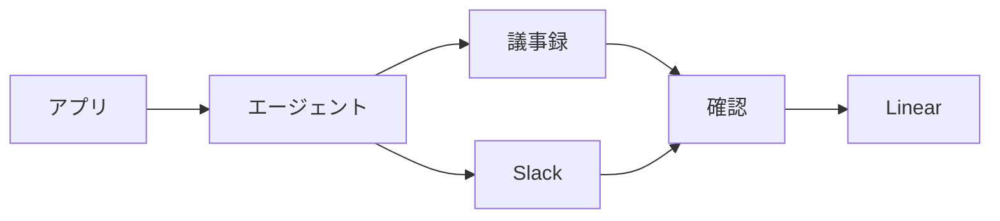

# Plumette

## Overview

Plumette は、議事録と Slack に届いた中村宛の依頼を Linear の Issue にする仕組みである。依頼はそれぞれの場所に残ったままで、Plumette が作るのは着手の入口となる Issue である。Issue は依頼ごとに中村の確認を得てから作り、marutto-ops チームに Triage 状態で置き、中身に合うプロジェクトを割り当てる。

Backlog は対象にしない。依頼は Backlog の課題としてそこに残り、担当も期限もその課題が持つため、Linear に写すと同じ作業が 2 か所に並ぶ。受け皿を持たない議事録と Slack だけを対象とする。

このドキュメントは仕組みと運用を説明する。Agent が実行する手順と実行タイミングは `.claude/scheduled-tasks/plumette/SKILL.md` にある。

## Mechanism

Plumette は Claude デスクトップアプリの定期タスクとして動く。アプリは設定された時刻にセッションを起動し、Agent がプロンプトに従って未起票の依頼を集める。Agent は依頼を Issue の案として番号付きの一覧で示し、実行を終える。中村がそのセッションに起票する案の番号を返信すると、Agent はその案だけを Issue にする。

議事録は Cogsworth が毎時 `15` 分に Lumiere へ登録する。Plumette はその 15 分後に動くため、登録されたばかりの議事録をその回で読める。

アプリが読み込むのは `~/.claude/scheduled-tasks/plumette/SKILL.md` で、このリポジトリの `SKILL.md` はその正本である。変更をアプリへ反映する手順は `.claude/scheduled-tasks/README.md` にある。

## Duplicates

同じ依頼を二重に起票したり二度示したりしないため、Plumette は起票済みの Issue と確認の記録を先に調べる。中村に割り当てられた Issue のうち、直近 `14` 日に作られたものと、作成日を問わず着手中・未着手のものを本文ごと取り、次の 2 つを手元で照合する。どちらかに当たった依頼は起票しない。

| check | 照合するもの | 照合先 |
| :-- | :-- | :-- |
| 出典 | 依頼の出典である議事録や Slack の投稿のリンク | 取ったすべての Issue と確認の記録 |
| ファイル | 依頼が指す Google のスライドやスプレッドシート | 完了もキャンセルもしていない Issue |

出典の照合は、同じ依頼を二度起票せず、二度示さないためにある。作成する Issue が出典の引用から始まるのは、次の実行でこの照合を成り立たせるためでもある。

確認の記録は `~/batb/tmp/plumette-asked.txt` にある。Agent は一覧を示す前に、依頼の出典と Issue の案の title を 1 行ずつ書き足す。返信の有無にかかわらず、次の実行が同じ依頼を示し直すことはない。

ファイルの照合は、進行中の作業に含まれる依頼を別の Issue にしないためにある。手で作った Issue は出典のリンクを持たないため、この照合で拾う。議事録の Google Doc は出典なので、ファイルの照合には使わない。1 つの会議から別々の宿題が出るためである。この照合で見送った依頼は、同じファイルが書かれた Issue と併せて一覧のあとに挙がる。

照合に Linear の検索は使わない。`list_issues` の検索は曖昧で、本文に書かれた URL を拾わないためである。

議事録は出典の照合を本文の読み込みより先に行う。本文は Lumiere ではなく Google Doc にあるため、既に起票された会議の議事録を毎回取りに行かずに済む。

## Operations

有効と無効の切り替え、実行タイミングの変更、今すぐの実行は、アプリの定期タスクの画面で行う。実行タイミングを変えたら、`SKILL.md` の `schedule` も同じ値に揃える。

対象は 2 つの入口それぞれで過去 `2` 日に届いた依頼である。毎時動くため、数回の実行を落としても取りこぼしは起きない。

起票する案は、定期タスクが起動したセッションを開き、番号を返信して選ぶ。返信は後からでもよく、選ばなかった案は起票されない。一覧に出た依頼は次の実行で示し直さないので、そのセッションで返信する。示し直させたいときは、確認の記録からその行を消す。過去 `2` 日のうちの依頼なら、次の実行で再び一覧に出る。

ファイルの照合で見送られて一覧のあとに挙がった依頼は、内容を確かめ、別の作業なら手で起票する。

## Troubleshooting

よくある症状と対処を示す。

| symptom | action |
| :-- | :-- |
| 予定の時刻になっても起票されない | 定期タスクはアプリが開いていて Mac が起きているときだけ動く。見逃した実行は、復帰後に直近の 1 回分だけ実行される |
| 同じ依頼の Issue が増える | 既存の Issue の本文に、出典か依頼が指すファイルのリンクがない。照合できるよう、既存の Issue の本文にそのリンクを足す |
| Issue にプロジェクトが付かない | 出典から引き当てられるプロジェクトがなかった。案に「なし」と出るので、返信で指定するか、起票後に手で割り当てる |
| 依頼が一覧に出ない | 確認の記録に同じ出典がある。示し直すなら、記録からその行を消す |
| 依頼が既存の Issue と同じファイルとして一覧のあとに挙がる | 同じファイルが書かれた、完了もキャンセルもしていない Issue がある。別の作業なら手で起票する |
