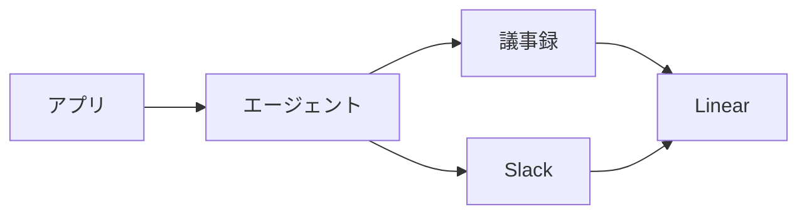

# Plumette

## Overview

Plumette は、議事録と Slack に届いた中村宛の依頼を Linear の Issue にする仕組みである。依頼はそれぞれの場所に残ったままで、Plumette が作るのは着手の入口となる Issue である。Issue は marutto-ops チームに Triage 状態で置き、中身に合うプロジェクトを割り当てる。

Backlog は対象にしない。依頼は Backlog の課題としてそこに残り、担当も期限もその課題が持つため、Linear に写すと同じ作業が 2 か所に並ぶ。受け皿を持たない議事録と Slack だけを対象とする。

このドキュメントは仕組みと運用を説明する。Agent が実行する手順と実行タイミングは `.claude/scheduled-tasks/plumette/SKILL.md` にある。

## Mechanism

Plumette は Claude デスクトップアプリの定期タスクとして動く。アプリは設定された時刻にセッションを起動し、Agent がプロンプトに従って未起票の依頼を Issue にする。人が立ち会わない実行なので、宛先を読み取れない依頼は起票せずに報告へ残す。

議事録は Cogsworth が毎時 `15` 分に Lumiere へ登録する。Plumette はその 15 分後に動くため、登録されたばかりの議事録をその回で読める。

アプリが読み込むのは `~/.claude/scheduled-tasks/plumette/SKILL.md` で、このリポジトリの `SKILL.md` はその正本である。変更をアプリへ反映する手順は `.claude/scheduled-tasks/README.md` にある。

## Duplicates

同じ依頼を二重に起票しないため、Plumette は起票済みの Issue を先に調べる。直近 `14` 日に中村へ割り当てられた Issue を本文ごと取り、出典のリンクが既にあるかどうかを手元で照合する。作成する Issue が出典の引用から始まるのは、次の実行でこの照合を成り立たせるためでもある。

照合に Linear の検索は使わない。`list_issues` の検索は曖昧で、本文に書かれた URL を拾わないためである。

議事録は照合を本文の読み込みより先に行う。既に起票された会議の議事録を毎回読み直さずに済む。

## Operations

有効と無効の切り替え、実行タイミングの変更、今すぐの実行は、アプリの定期タスクの画面で行う。実行タイミングを変えたら、`SKILL.md` の `schedule` も同じ値に揃える。

対象は 2 つの入口それぞれで過去 `2` 日に届いた依頼である。毎時動くため、数回の実行を落としても取りこぼしは起きない。

報告に残った依頼は、内容を確かめたうえで手で起票する。過去 `2` 日を過ぎると Plumette は拾わなくなるので、報告を見た日のうちに処理する。

## Troubleshooting

よくある症状と対処を示す。

| symptom | action |
| :-- | :-- |
| 予定の時刻になっても起票されない | 定期タスクはアプリが開いていて Mac が起きているときだけ動く。見逃した実行は、復帰後に直近の 1 回分だけ実行される |
| 同じ依頼の Issue が増える | Issue の本文から出典のリンクが抜けている。重複確認が照合できないため、引用ごと書き直す |
| Issue にプロジェクトが付かない | 出典から引き当てられるプロジェクトがなかった。報告に名前が出るので、手で割り当てる |
| 依頼が起票されずに報告だけ残る | 宛先や担当を読み取れていない。内容を確かめて手で起票する |
