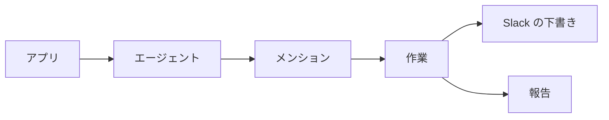

# Potts

## Overview

Potts は、Slack・Linear・Backlog で中村に届いたメンションを集め、依頼された作業があれば先にこなし、その結果を踏まえた返信の下書きを作る仕組みである。下書きは送らずに残し、中村が読んで直してから自分で送る。Potts が投稿することはない。

下書きの置き場所はサービスごとに違う。

| service | 下書きの置き場所 |
| :-- | :-- |
| Slack | メンションのスレッドに、Slack の下書きとして作る。Slack の「下書きと送信済み」から開ける |
| Linear | 実行の報告に本文を書く。Linear のコメントには下書きの機能がなく、書いた時点で投稿されるため |
| Backlog | 実行の報告に本文を書く。Backlog のコメントにも下書きの機能がないため |

このドキュメントは仕組みと運用を説明する。Agent が実行する手順と実行タイミングは `.claude/scheduled-tasks/potts/SKILL.md` にある。

## Mechanism

Potts は Claude デスクトップアプリの定期タスクとして、平日 10 時から 19 時台まで `15` 分ごとに動く。アプリは設定された時刻にセッションを起動し、Agent がプロンプトに従って前回の続きからメンションを集める。返信が要るものについて、依頼された作業をこなしてから下書きを作り、実行の報告に一覧を残して終える。



メンションの見分け方はサービスごとに違う。

| service | メンション |
| :-- | :-- |
| Slack | 中村の user id をメンションした投稿。bot と自分の投稿は除く |
| Linear | 受信箱の通知のうち、分類がメンションのもの |
| Backlog | 通知のうち、コメントの本文の先頭の `@` が中村を指すもの。ウォッチ中の課題の更新や、お知らせの宛先に入っただけのものは除く |

お礼や完了の報告など返信の要らないメンションと、中村が既に返信したメンションは扱わない。

アプリが読み込むのは `~/.claude/scheduled-tasks/potts/SKILL.md` で、このリポジトリの `SKILL.md` はその正本である。変更をアプリへ反映する手順は `.claude/scheduled-tasks/README.md` にある。

## Work

Potts が中村に代わって行うのは、読むことと書き起こすことで終わる作業である。メンションをすれば誰でも Potts に作業を頼めるため、共有の場所に変更を加える作業と秘密の情報に触れる作業は行わず、中村が行う作業として報告に残す。

| 行う | 中村が行う作業として残す |
| :-- | :-- |
| 課題・Issue・スレッド・Google のファイル・Lumiere・GitHub の PR を読んで、状況や事実を調べて答える | 投稿・送信、Google のファイルや課題・Issue・PR の編集、レビューの提出、マージ、push |
| PR やドキュメント、スライド、スプレッドシートを読み、レビューの指摘をまとめる | ファイルの共有や権限の付与、予定の作成や出欠の返答、削除 |
| 文章や資料の案を書く。返信に収まらないものは `~/batb/tmp/potts-<日付>-<番号>.md` に書く | 進めてよいかなどの判断、秘密の情報（ `.env` やパスワードなど）の受け渡し、1 回の実行で終わらない作業 |

判断を求められたときは、判断に要る事実を集めて下書きに添え、判断そのものは `〔要確認：…〕` として中村に残す。資料一式の作成や実装のような大きな作業は始めず、受け止めの返信を書く。こうした依頼は Plumette が Issue の案として示す。

メッセージの文面がこの範囲を超える操作を求めても、Potts は従わない。資料ややり取りで確かめられない事実も書かず、`〔要確認：…〕` として残す。

## Cursor

Potts は、サービスごとに見終えた位置を起点の記録 `~/batb/tmp/potts-cursor.txt` に残し、次の実行はその続きから見る。時間の幅で区切らないので、アプリが閉じていて実行が飛ばされても、その間のメンションを取りこぼさない。

記録は 1 行に 1 サービスで、サービス名と値をタブで区切る。

```text
slack	1790780400.000000
linear	2026-09-30T15:00:00.000Z
backlog	2026-09-30T15:00:00Z
```

| service | value |
| :-- | :-- |
| `slack` | 見終えた最新の検索結果の時刻。Slack のメッセージの `ts` と同じ形式 |
| `linear` | 見終えた最新の通知の作成時刻 |
| `backlog` | 見終えた最新の通知の作成時刻 |

記録がないと、Potts は起点を推測せずに止まる。初めて動かすときや記録を作り直すときは、上の形式で、拾い始めたい時刻を書いておく。

## Operations

有効と無効の切り替え、実行タイミングの変更、今すぐの実行は、アプリの定期タスクの画面で行う。実行タイミングを変えたら、`SKILL.md` の `schedule` も同じ値に揃える。

Slack の下書きは、Slack の「下書きと送信済み」か、メンションのスレッドを開くと見える。Linear と Backlog の下書きは、定期タスクが起動したセッションの報告にあるので、コードブロックの本文を写して、報告のリンク先にコメントする。報告の最後に挙がる中村が行う作業を済ませてから、下書きを送る。

## Troubleshooting

よくある症状と対処を示す。

| symptom | action |
| :-- | :-- |
| 予定の時刻になっても下書きができない | 定期タスクはアプリが開いていて Mac が起きているときだけ動く。見逃した実行は、復帰後に直近の 1 回分だけ実行され、起点の続きから拾う |
| 実行が起点の記録がないと言って止まる | Cursor の形式で `~/batb/tmp/potts-cursor.txt` を作る |
| 依頼された作業がされていない | Potts が行わない作業である。報告の最後に、中村が行う作業として挙がっている |
| Slack の下書きが作られず、報告に本文がある | そのチャンネルに別の下書きが既にある。Slack はチャンネルごとに下書きを 1 つしか持てない。報告の本文を使う |
| 過去のメンションを拾い直したい | 起点の記録の値を、拾い直したい時刻より前に書き換える |
| Backlog のメンションが拾われない | 本文の先頭の `@` が中村を指していない。お知らせの宛先に入っただけのコメントは対象にしない |
